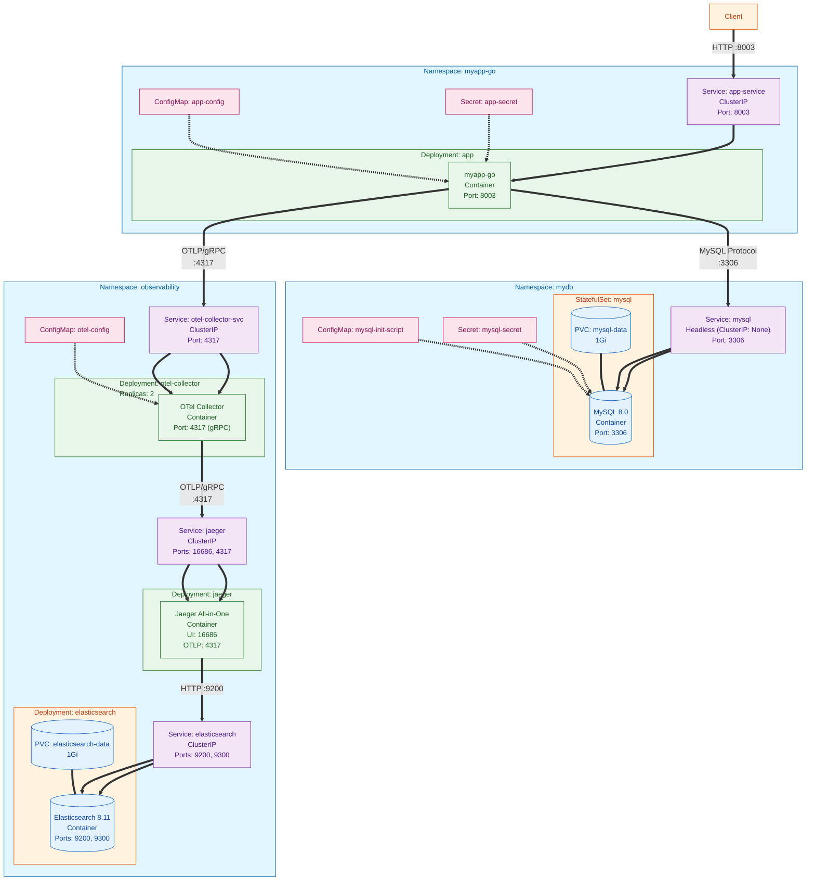

# Movie Service - Kubernetes Observability Stack

A Go-based REST API for movie management with distributed tracing using OpenTelemetry and Jaeger on Kubernetes.

## Tech Stack

| Component | Technology | Version |
|-----------|------------|---------|
| Application | Go | 1.24 |
| Database | MySQL | 8.0 |
| Tracing | OpenTelemetry SDK | 1.39.0 |
| Trace Collector | OpenTelemetry Collector | latest |
| Trace Backend | Jaeger (all-in-one) | latest |
| Container Runtime | Docker | - |
| Orchestration | Kubernetes | - |
| SQL Instrumentation | otelsql | 0.41.0 |

## API Endpoints

| Method | Endpoint | Description |
|--------|----------|-------------|
| GET | `/` | Health check |
| GET | `/movies` | List all movies |
| POST | `/movie` | Add a new movie |

## Low-Level Design (LLD)



## Architecture Overview

### Namespaces

| Namespace | Purpose |
|-----------|---------|
| `myapp-go` | Application workload |
| `mydb` | Database layer |
| `observability` | Tracing infrastructure |

### Workloads

| Workload | Type | Namespace | Replicas | Ports |
|----------|------|-----------|----------|-------|
| app | Deployment | myapp-go | 1 | 8003 |
| mysql | StatefulSet | mydb | 1 | 3306 |
| otel-collector | Deployment | observability | 2 | 4317 |
| jaeger | Deployment | observability | 1 | 16686, 4317 |
| elasticsearch | Deployment | observability | 1 | 9200, 9300 |

### Services

| Service | Type | Namespace | Port(s) | Target |
|---------|------|-----------|---------|--------|
| app-service | ClusterIP | myapp-go | 8003 | app pods |
| mysql | Headless | mydb | 3306 | mysql pods |
| otel-collector-svc | ClusterIP | observability | 4317 | otel-collector pods |
| jaeger | ClusterIP | observability | 16686, 4317 | jaeger pods |
| elasticsearch | ClusterIP | observability | 9200, 9300 | elasticsearch pods |

### Data Flow

1. Client sends HTTP requests to `app-service:8003`
2. Go application processes requests and queries MySQL via `mysql.mydb.svc.cluster.local:3306`
3. Application sends traces via OTLP/gRPC to `otel-collector-svc.observability.svc.cluster.local:4317`
4. OTel Collector forwards traces to `jaeger.observability.svc.cluster.local:4317`
5. Jaeger persists traces to Elasticsearch via `elasticsearch.observability.svc.cluster.local:9200`
6. Jaeger UI available at port `16686` for trace visualization

## Quick Start

```bash
# Apply manifests in order
kubectl apply -f K8s/mysql.yaml
kubectl apply -f K8s/elasticsearch/elasticsearch.yaml
kubectl apply -f K8s/jaegar/jaegar.yaml
kubectl apply -f K8s/otel-collector/otel-collector.yaml
kubectl apply -f K8s/app.yaml

# Port-forward Jaeger UI
kubectl port-forward -n observability svc/jaeger 16686:16686

# Port-forward application
kubectl port-forward -n myapp-go svc/app-service 8003:8003
```

## Project Structure

```
app-db/
├── K8s/
│   ├── app.yaml              # Application deployment
│   ├── mysql.yaml            # MySQL StatefulSet
│   ├── elasticsearch/
│   │   └── elasticsearch.yaml # Elasticsearch for Jaeger storage
│   ├── jaegar/
│   │   └── jaegar.yaml       # Jaeger deployment
│   └── otel-collector/
│       └── otel-collector.yaml
└── src/
    ├── main.go               # HTTP handlers & DB operations
    ├── telemetry.go          # OTel tracer initialization
    ├── go.mod
    └── Dockerfile
```
